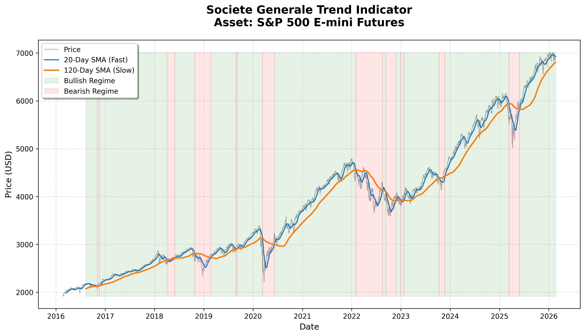

# QuantDataPipeline: Medallion Architecture and Trend Strategy

A production-grade quantitative data pipeline that automates the ingestion, transformation, and signal generation for Futures markets. This project utilizes a Medallion Architecture to move data from raw ingestion to strategy-ready analytical sets.

## System Architecture

The pipeline is designed for high availability and multi-provider connectivity, organized into three logical layers:

1. **Bronze (Raw):** Immutable historical data fetched from source providers.
2. **Silver (Cleaned):** Data processed for integrity, including gap-filling (forward-fills), outlier detection, and derived log returns.
3. **Gold (Analytical):** Feature-engineered datasets containing technical indicators and signal logic.

### Markets Analyzed
The pipeline processes high-liquidity Futures contracts, specifically:
* **ES**: E-mini S&P 500 (Equity Index)
* **NQ**: E-mini Nasdaq 100 (Technology Index)
* **CL**: Crude Oil (Energy Commodity)

### Multi-Source Connectivity
The `ingestors.py` module is architected to support multiple data providers:
* **Yahoo Finance API** (Default historical provider)
* **Interactive Brokers (IBKR)** (Production-level execution data)
* **TradeStation** (Institutional fidelity data)

## Data Quality and Provenance

To ensure strategy reliability, the pipeline generates a **Cleaning Proof** audit trail via the `generate_global_audit` utility. This validates the transition from Bronze to Silver by documenting the specific repairs made to the raw price data.

### Data Cleaning Audit Sample (`cleaning_audit_proof.csv`)
| Date | Symbol | Raw_Price | Cleaned_Price | Audit_Note |
| :--- | :--- | :--- | :--- | :--- |
| 2026-02-17 | ES | 5020.25 | 5020.25 | Data Integrity Verified (100% Clean) |
| 2026-02-18 | ES | NaN | 5020.25 | Gap Found & Repaired |
| 2026-02-19 | ES | 5025.50 | 5025.50 | Data Integrity Verified (100% Clean) |
| 2026-02-20 | ES | 5028.75 | 5028.75 | Data Integrity Verified (100% Clean) |

## Quantitative Strategy: Societe Generale Trend Indicator

Once the data has been cleaned and validated, it is ready for institutional-grade research and trading. This pipeline includes the Gold layer to demonstrate that the data is primed for indicators, signals, and systematic trading models.

As a primary use case, this pipeline implements the **Societe Generale (SG) Trend Indicator**, a classic trend-following model used by managed futures funds:
* **Fast SMA:** 20-period
* **Slow SMA:** 120-period
* **Logic:** Generates a bullish regime (+1) when the 20-period SMA crosses above the 120-period, and a bearish regime (-1) when it crosses below.

### Strategy Performance Visualization


## Project Structure

```text
QuantDataPipeline/
├── data/               
│   ├── bronze/         # Raw data storage (Immutable)
│   ├── silver/         # Cleaned and validated data (Gap-filled)
│   ├── gold/           # Strategy-ready features (Signals)
│   └── cleaning_audit_proof.csv # Detailed data integrity log
├── src/                # Source Code
│   ├── main.py         # Pipeline Orchestrator
│   ├── storage.py      # DataVault I/O Logic (Parquet/Local)
│   ├── ingestors.py    # Connectivity (YFinance, IBKR, TradeStation)
│   ├── processors.py   # Data cleaning and validation logic
│   ├── strategies.py   # Signal generation (Societe Generale Trend)
│   ├── visualizer.py   # Technical analysis plotting
│   └── reporter.py     # Automated execution reporting
├── tests/              # Integrity and Unit tests
│   └── test_pipeline.py
├── plots/              # Strategy visualizations
└── reports/            # Automated logs and status reports
```